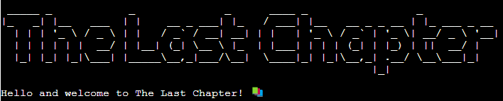
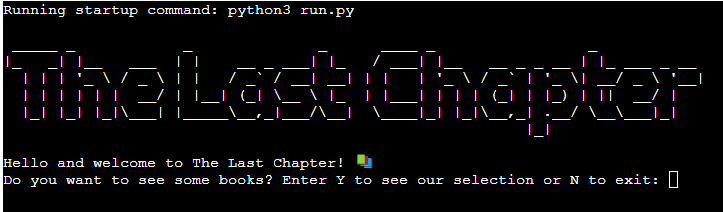
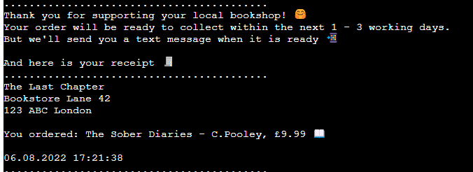
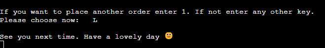
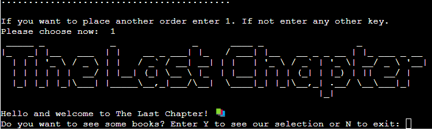

# The Last Chapter

## A website to browse and order books

--------------------------------------

## Table of Contents

--------------------------------------

- [Description](#description)
- [Theme](#theme)
- [Objective](#objective)
- [Features](#features)
    - [Future Features](#future-features)
- [Testing](#testing)
- [Technologies](#technologies)
- [Deployment](#cloning)
- [Credits](#credits)
- [Acknowledgements](#acknowledgements)
- [Author Info](#author-info)

------

## Description
----------------------------------------

As an avid reader, I wanted to create a little bookshop and allow the user to browse and have a look at the available titles and order a book if he wishes. 

-----------------------------------------

## Theme

-----------------------------------------
Despite the project being entirely text-based, I implemented a few little things to make it more user-friendly. When the user enters the site, he will be greeted with a big heading and the name of the bookshop, ‘The Last Chapter’. Furthermore, I added emojis throughout the entire programme where appropriate and added slight delays for various reasons. An explanation follows where the sleep function has been used.

-----

## User Experience
---------------------------------

### User Stories
------------------------------------
As a first time visitor:

- I want to have the option to have a look around and decide if I wish to have a look around or leave  the shop and not be forced to run through the entire program 
- I want clear instructions on the navigation

As a returning visitor:

- I want to be able to have another look around and order another book of the selection if I choose to

-----

### Python Logic
--------------

Before I started my programme I drew a flowchart so I knew which functions I had to create and how I wanted to lay this out. 

-------
## Features
------------

### Start/first decision

 The user is greeted with the name of the bookshop together with a welcome message. Here he can decide if he wishes to see our collection or change his mind and leave the shop instead. The option is to enter either Y or N. I ensured to capture a small letter as well. Throughout the entire programme, I also added the .strip() function in case the user accidentally enters a space before or after the input.
  

---------------------
#### Leave Shop 

If the user changes his mind, he can leave the shop by entering N.

------------------------------
### See Selection/second decision

If the user decides to have a look, a list of books will be printed and displayed. To create anticiptation , the .sleep() function has been implemented with a delay of 1 second to display the titles.

----------------
#### Leave Shop 

If the user decides to not go ahead and order a book, he can enter any other key but the numbers between 1 and 8 to leave the shop.

-----------------
### Select Book

If the user wishes to order a book, he is asked to enter a number between 1 and 8 to choose the desired title. 

-------------------
### User Information

As this project has been linked to a Google Sheet, I added a small paragraph to inform the user that the data will be added to this Sheet but confirm that the data will only be collected for the purpose of this project and only be seen by me. I added a 5 second delay to allow the user enough time to read this message before the programme continues.

------------------
### Enter details

The user is now asked to enter the first and last name and his UK mobile number.

### Enter Details - incorrect mobile number

If the user doesn't enter a valid 11-digit UK number, a message pops up and informs him that it is incorrect. He can then enter the details again. Until the user enters an 11-digit number, the programme loops through it again and again.

### Confirm or correct details

After entering all his details, the user can then read over them again and either confirm the details by entering the digit 1 or enter the number 2 if he made a mistake somewhere.

If he confirms his choice a message appears and letting the user know we can finish up this order now.

## Confirmed Details & Google Sheet

Once the user has confirmed his details, they are simultaneously added to the Google Sheet.

### Thank you & Receipt

At this stage the user is being thanked for supporting his local bookshop and a small receipt will be printed. Another delay of 2 second has been added before the receipt has been 'printed'. On this receipt the user will find the address of the shop, the title and price of the book he ordered and the date and time.

## Last choice

The user is now being asked if he wishes to place an other order or leave the shop. If he wishes to leave he is asked to enter N and a goodbye message pops up and the programme ends.

If he wishes to place an other order he is asked to enter Y and the programme starts again from the begining.

## Future Features
--------------------------

- To migrate the booklist to a Google sheet and pull out the titles from there for a wider selection
- To give the user the option to enter an email address instead/addition off a phone number
- To allow the user to order multiple books at the same time

[Back to the Top](#table-of-contents)

-----
## Technologies Used 
---------------------

- Python, to write my code
- Heroku, to deploy my site

-----------------------------

## Python Libraries/Modules
---------------------------

- Time - to add the .sleep() function and delay my code in the terminal
- [Datetime](https://www.programiz.com/python-programming/datetime/strftime) - to print the current date and time on the receipt
- [Sys](https://www.hashbangcode.com/article/stopping-code-execution-python) - to exit the programme
- [Pyfiglet](https://www.geeksforgeeks.org/python-ascii-art-using-pyfiglet-module/) - to create a header    for the bookshop,
- Gspread - as API for my Google Sheet

[Back to the Top](#table-of-contents)

-----
## Testing
-------------

The site has been tested by me thouroughly during the creation to ensure that the programme runs like it should and errors are being caught.

[Back to the Top](#table-of-contents)

### Browser Testing
-----------------------

The programme has been tested on Google Chrome, Firefox and Safari without any issues. Due to the nature of the programme, it is not suitable for mobile phones and smaller devices.

### Validators 
----------------------

The code has been tested by running it through the PeP8. Almost all of the errors which have been encountered were due to trailing whitespaces or either too many or not enough blank lines.

No errors were found during the final check.

-----------------------------

### Issues/Bugs Fixed 
-----------------------------

  Any issues or bugs that were encountered were mainly due to indentation errors spelling mistakes and import mistakes.
  These were fixed in production as they were found so when it came to validating my code with the PEP8 validator
  there were no errors and my code was clean.  

[Back to the Top](#table-of-contents)

### Git and GitHub 
----------------------

Local repository and IDE used: GitPod & VsCode for early trials of how to move forward.
Remote repository used: GitHub

Steps followed: 
- I created a new public repository on GitHub using the Code Institute template.
- I then created a workspace and started coding on GitPod. 
- All relevant files were created. 
- To save my work safely I continued to use the terminal consistently by using: 
    - **git add .** to add work to git
    - **git commit -m""** to commit the work 
    - **git push** to update work to GitHub 

---------------------------
### Deployment to Heroku
---------------------------

The website was deployed to heroku by doing the following: 

1. Navigate to [heroku](https://id.heroku.com/login). 

2. Click "new" and create a new App. 

3. Give your app a name, choose your region and Click "Create app". 

4. The menus that we are concerned with are "Deploy" and "Settings". Click on "Settings" First. 

5. Buildpacks now need to be added. These install future dependancies that we need outside of the requirements file. The first is python and the second is node.js. Select Python first and then node.js and click save. Make sure they are in this order.

6. Then go to the deploy section and choose your deployment method. To connect with github select github and confirm. 

7. Search for your repo, select it and click connect. 

8. You can choose to either deploy using automatic deploys which means heroku will rebuild the app everytime you push your changes. For this option choose the branch to deploy and click enable automatic deploys. This can be changed at a later date to manual. Manual deployment deploys the current state of a branch.  

9. Click deploy branch. 

10. If successful you should be able to view your deployed app by clicking "View". 
    

## Credits 
--------------------

- [Stackoverflow](https://stackoverflow.com/questions/10660435/how-do-i-split-the-definition-of-a-long-string-over-multiple-lines) - for guidance on how to display long string
- [Hashbangcode](https://www.hashbangcode.com/article/stopping-code-execution-python) - how to stop the programme
- [MakeUseOf](https://www.makeuseof.com/how-to-include-emojis-in-your-python-code/) - for the syntax to add emojis
- [W3 School](https://www.w3schools.com/python/gloss_python_loop_dictionary_items.asp) - to provide me with a better option to iterate through a dictionary than my original code 
        * Original solution:
    for key in book_list:
                print(key, book_list[key])*
        * Final version:
    for index_list, title in book_list.items():
                print(index_list, title)
- [Python Basics](https://pythonbasics.org/multiple-return/) - guidane on how to return multiple variables from a function
- [GeeksForGeeks](https://www.geeksforgeeks.org/python-ascii-art-using-pyfiglet-module/) - help on which module to import and how to create my header
- [W3 School](https://www.w3schools.com/howto/howto_css_fixed_footer.asp) - how to fix my social icons to the footer
- Love Sandwiches - for general guidance 

[Back to the Top](#table-of-contents)

-----
## Acknowledegments
---------------------------

[Back to the Top](#table-of-contents)

